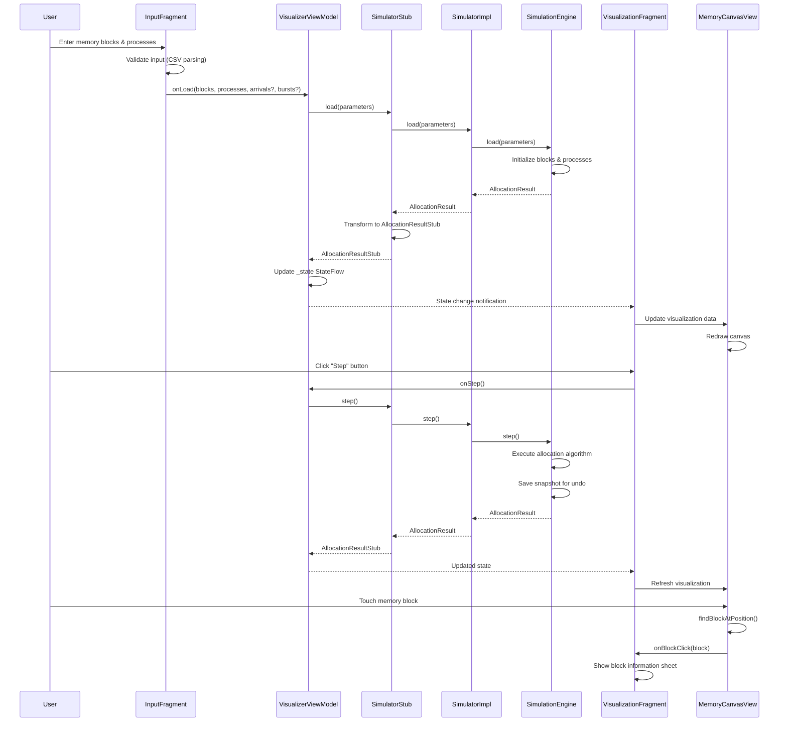

# Memory Visualizer - Complete System Documentation

## 📚 Table of Contents
1. [System Overview](#system-overview)
2. [Architecture Design](#architecture-design)
3. [Component Documentation](#component-documentation)
4. [Data Flow & Interactions](#data-flow--interactions)
5. [Feature Implementation](#feature-implementation)
6. [Performance & Quality](#performance--quality)
7. [Development Guidelines](#development-guidelines)
8. [System Extensibility](#system-extensibility)

---

## 🎯 System Overview

### **Project Description**
Memory Visualizer is a sophisticated Android application designed for educational purposes to demonstrate and simulate dynamic memory allocation algorithms used in operating systems. The application provides an interactive platform for students and educators to visualize how different allocation strategies (First Fit, Best Fit, Worst Fit) manage memory blocks and process allocation in real-time.

### **Core Capabilities**
- 🧮 **Memory Allocation Simulation**: Interactive simulation of OS memory management
- 🎯 **Multiple Allocation Strategies**: First Fit, Best Fit, and Worst Fit algorithms
- ⏱️ **Time-Based Scheduling**: Process arrival times and burst times with SJF tie-breaking
- 📊 **Real-Time Visualization**: Touch-enabled memory canvas with visual feedback
- 🔄 **State Management**: Complete undo/redo functionality with history preservation
- 📈 **Fragmentation Analysis**: Internal and external fragmentation metrics
- 🗜️ **Memory Compaction**: Dynamic memory compaction with efficiency analysis
- 📱 **Modern UI**: Material Design 3 with accessibility support

### **Target Audience**
- 🎓 **Computer Science Students**: Learning operating systems concepts
- 👨‍🏫 **Educators**: Teaching memory management principles
- 🔬 **Researchers**: Analyzing allocation algorithm performance
- 👨‍💻 **Developers**: Understanding memory management implementation

---

## 🏗️ Architecture Design

### **Overall Architecture Pattern**
The system implements a **3-Layer Clean Architecture** with **MVVM (Model-View-ViewModel)** pattern:

```
┌─────────────────────────────────────────────────────────┐
│                    UI LAYER (Presentation)             │
│  ┌─────────────┐  ┌─────────────┐  ┌─────────────┐    │
│  │  Fragment   │  │  ViewModel  │  │ Custom View │    │
│  │   (View)    │◄►│   (State)   │◄►│  (Canvas)   │    │
│  └─────────────┘  └─────────────┘  └─────────────┘    │
└─────────────────────────────────────────────────────────┘
                              ▲
                              │ StateFlow/SharedFlow
                              ▼
┌─────────────────────────────────────────────────────────┐
│               ADAPTER LAYER (Stub)                     │
│  ┌─────────────────────────────────────────────────────│
│  │              SimulatorStub                          │
│  │  • UI-friendly data transformation                  │
│  │  • API facade pattern                               │
│  │  • Backward compatibility layer                     │
│  └─────────────────────────────────────────────────────│
└─────────────────────────────────────────────────────────┘
                              ▲
                              │ Domain Models
                              ▼
┌─────────────────────────────────────────────────────────┐
│              BUSINESS LAYER (Domain)                    │
│  ┌─────────────┐  ┌─────────────┐  ┌─────────────┐    │
│  │  Simulator  │  │   Engine    │  │  Strategies │    │
│  │ (Interface) │◄►│   (Core)    │◄►│  (Plugins)  │    │
│  └─────────────┘  └─────────────┘  └─────────────┘    │
└─────────────────────────────────────────────────────────┘
```

### **Design Patterns Implemented**

#### **1. Strategy Pattern**
```kotlin
// Pluggable allocation algorithms
interface AllocationStrategy {
    fun chooseBlock(freeBlocks: List<MemoryBlock>, processSize: Int): MemoryBlock?
    val name: String
}

// Runtime strategy switching
simulator.setStrategy(FirstFitStrategy())
simulator.setStrategy(BestFitStrategy())
simulator.setStrategy(WorstFitStrategy())
```

#### **2. Command Pattern (Undo/Redo)**
```kotlin
// State snapshots for reversible operations
class SimulationEngine {
    private val snapshots = mutableListOf<AllocationResult>()
    private val timeSnapshots = mutableListOf<Int>()
    private var cursor = -1
    
    fun undo(): AllocationResult? = restoreFromSnapshot(cursor - 1)
    fun redo(): AllocationResult? = restoreFromSnapshot(cursor + 1)
}
```

#### **3. Facade Pattern**
```kotlin
// Simplified API for complex domain interactions
class SimulatorStub {
    private val realSimulator: SimulatorImpl
    
    fun loadSimple(blocks: List<Int>, processes: List<Int>) {
        // Simplified interface hiding complexity
    }
}
```

#### **4. Observer Pattern (Reactive Architecture)**
```kotlin
// Reactive state management
class VisualizerViewModel : ViewModel() {
    private val _state = MutableStateFlow<AllocationResultStub?>(null)
    val state: StateFlow<AllocationResultStub?> = _state.asStateFlow()
    
    private val _errors = MutableSharedFlow<String>()
    val errors: SharedFlow<String> = _errors.asSharedFlow()
}
```

---

## 🔧 Component Documentation

### **1. Business Logic Layer (`model/`)**

#### **Core Simulation Engine**
```kotlin
// Central orchestrator of memory allocation simulation
class SimulationEngine internal constructor() {
    // State Management
    private val blocks = mutableListOf<MemoryBlock>()
    private val processes = mutableListOf<ProcessDef>()
    private var currentTime = 0
    private val allocationTimes = mutableMapOf<String, Int>()
    
    // History Management (Command Pattern)
    private val snapshots = mutableListOf<AllocationResult>()
    private var cursor = -1
    
    // Core Operations
    fun step(): AllocationResult              // Single allocation step
    fun runAll(): AllocationResult           // Complete simulation
    fun compact(): AllocationResult          // Memory compaction
    fun undo(): AllocationResult?            // Undo last action
    fun redo(): AllocationResult?            // Redo action
}
```

**Key Responsibilities:**
- 🎮 **Simulation Control**: Step-by-step and complete execution
- 🧠 **Memory Management**: Block allocation, splitting, coalescing
- ⏰ **Time Management**: Process arrivals, burst time handling
- 📸 **State Preservation**: Snapshot system for undo/redo
- 📊 **Metrics Calculation**: Fragmentation and utilization statistics

#### **Memory Block Model**
```kotlin
data class MemoryBlock(
    val id: String,           // Unique identifier
    val start: Int,           // Memory address start
    val size: Int,            // Block size
    val isFree: Boolean       // Allocation status
) {
    val end: Int get() = start + size                    // Calculated end address
    fun canFit(processSize: Int) = isFree && size >= processSize
    fun isAdjacentTo(other: MemoryBlock) = /* adjacency logic */
}
```

#### **Process Definition with Timing**
```kotlin
data class ProcessDef(
    val id: String,                          // Process identifier
    val size: Int,                           // Memory requirement
    val status: ProcessStatus,               // Current state
    val arrivalTime: Int = 0,                // When process becomes available
    val burstTime: Int? = null,              // Execution time (null = infinite)
    val remainingBurst: Int? = burstTime     // Time left for completion
) {
    // Time-aware methods
    fun hasArrived(currentTime: Int) = currentTime >= arrivalTime
    fun shouldAutoFree(currentTime: Int, allocationTime: Int) = 
        burstTime?.let { currentTime >= allocationTime + it } ?: false
}
```

#### **Allocation Strategies**
```kotlin
// First Fit: O(n) - First suitable block
class FirstFitStrategy : AllocationStrategy {
    override fun chooseBlock(freeBlocks: List<MemoryBlock>, processSize: Int) =
        freeBlocks.firstOrNull { it.canFit(processSize) }
}

// Best Fit: O(n) - Smallest suitable block
class BestFitStrategy : AllocationStrategy {
    override fun chooseBlock(freeBlocks: List<MemoryBlock>, processSize: Int) =
        freeBlocks.filter { it.canFit(processSize) }
                  .minByOrNull { it.size }
}

// Worst Fit: O(n) - Largest suitable block  
class WorstFitStrategy : AllocationStrategy {
    override fun chooseBlock(freeBlocks: List<MemoryBlock>, processSize: Int) =
        freeBlocks.filter { it.canFit(processSize) }
                  .maxByOrNull { it.size }
}
```

### **2. Adapter Layer (`stub/`)**

#### **SimulatorStub - UI Adaptation**
```kotlin
class SimulatorStub {
    // UI-friendly data models
    data class BlockStub(
        val id: String,
        val start: Int,
        val size: Int,
        val isFree: Boolean,
        val processId: String?,
        val color: String,              // UI color representation
        val internalFragmentation: Int  // UI-specific calculation
    )
    
    data class AllocationResultStub(
        val freeBlocks: List<BlockStub>,
        val allocatedBlocks: List<BlockStub>,
        val waitingProcesses: List<ProcessStub>,
        val allocatedProcesses: List<ProcessStub>,
        val fragmentation: StatsStub,
        val lastAction: String,
        val canUndo: Boolean,
        val canRedo: Boolean
    )
    
    // Domain model transformation
    companion object {
        fun from(result: AllocationResult): AllocationResultStub {
            // Complex transformation logic
        }
    }
}
```

**Key Responsibilities:**
- 🔄 **Data Transformation**: Convert domain models to UI-friendly formats
- 🎨 **UI Enhancements**: Add color coding, formatting, display calculations
- 🛡️ **API Stability**: Provide consistent interface for UI layer
- 📊 **Derived Metrics**: Calculate UI-specific statistics and properties

### **3. User Interface Layer (`ui/`)**

#### **MVVM Architecture Implementation**

##### **VisualizerViewModel - State Management**
```kotlin
class VisualizerViewModel(private val sim: SimulatorStub) : ViewModel() {
    // Reactive state management
    private val _state = MutableStateFlow<AllocationResultStub?>(null)
    val state: StateFlow<AllocationResultStub?> = _state.asStateFlow()
    
    private val _errors = MutableSharedFlow<String>()
    val errors: SharedFlow<String> = _errors.asSharedFlow()
    
    // Public interface
    fun onLoad(blocks: List<Int>, processes: List<Int>) { /* ... */ }
    fun onLoad(blocks: List<Int>, processes: List<Int>, 
              arrivals: List<Int>?, bursts: List<Int?>?) { /* ... */ }
    fun onStep() = update { sim.step() }
    fun onRun() = update { sim.runAll() }
    fun onCompact() = update { sim.compact() }
}
```

##### **InputFragment - Configuration Interface**
```kotlin
class InputFragment : Fragment(R.layout.fragment_input) {
    // UI Components
    private lateinit var etBlocks: EditText
    private lateinit var etProcesses: EditText
    private lateinit var switchAdvanced: SwitchMaterial
    private lateinit var etArrivals: EditText
    private lateinit var etBursts: EditText
    
    // Advanced functionality
    private fun setupAdvancedToggle() {
        switchAdvanced.setOnCheckedChangeListener { _, isChecked ->
            advancedContainer.visibility = if (isChecked) View.VISIBLE else View.GONE
        }
    }
    
    // Input validation
    private fun validateAndLoad() {
        val validation = validateNow()
        if (validation.isValid) {
            if (switchAdvanced.isChecked) {
                // Advanced mode with timing
                vm.onLoad(blocks, processes, arrivals, bursts)
            } else {
                // Simple mode
                vm.onLoad(blocks, processes)
            }
        }
    }
}
```

##### **MemoryCanvasView - Interactive Visualization**
```kotlin
class MemoryCanvasView @JvmOverloads constructor(
    context: Context, attrs: AttributeSet? = null
) : View(context, attrs) {
    
    // Interaction handling
    override fun onTouchEvent(event: MotionEvent): Boolean {
        when (event.action) {
            MotionEvent.ACTION_DOWN -> {
                val clickedBlock = findBlockAtPosition(event.x, event.y)
                clickedBlock?.let { 
                    onBlockClick?.invoke(it)
                    performHapticFeedback(HapticFeedbackConstants.CONTEXT_CLICK)
                }
            }
        }
        return true
    }
    
    // Custom drawing
    override fun onDraw(canvas: Canvas) {
        super.onDraw(canvas)
        renderBlocks.forEach { block ->
            // Draw memory blocks with proper scaling and coloring
            drawBlock(canvas, block)
            drawBlockLabel(canvas, block)
        }
    }
}
```

---

## 🔄 Data Flow & Interactions

### **Complete System Data Flow**



### **State Management Architecture**

```kotlin
// Reactive state flow
VisualizerViewModel {
    StateFlow<AllocationResultStub?> ──→ VisualizationFragment
                                    ├──→ InputFragment (error states)
                                    └──→ MemoryCanvasView (render data)
    
    SharedFlow<String> (errors) ────→ InputFragment (error display)
    SharedFlow<Unit> (loaded) ──────→ UI Navigation (tab switching)
}
```

### **Time-Based Simulation Flow**

```kotlin
// Advanced scheduling logic
fun step(): AllocationResult {
    // 1. Handle burst time completions (auto-free)
    handleBurstCompletions()
    
    // 2. Find next available process (arrival time + SJF)
    val nextProcessIndex = findNextAvailableProcess()
    
    if (nextProcessIndex != null) {
        // 3. Attempt allocation with current strategy
        val process = processes[nextProcessIndex]
        val freeBlocks = blocks.filter { it.isFree }.sortedBy { it.start }
        val chosenBlock = strategy.chooseBlock(freeBlocks, process.size)
        
        if (chosenBlock != null) {
            // 4. Perform allocation and block splitting
            splitAndAllocate(chosenBlock, process)
            allocationTimes[process.id] = currentTime
        } else {
            // 5. Mark as failed allocation
            processes[nextProcessIndex] = process.copy(status = ProcessStatus.FAILED)
        }
    } else {
        // 6. Advance time to next arrival if needed
        findNextArrivalTime()?.let { nextTime ->
            currentTime = nextTime
        }
    }
    
    return snapshot()
}
```

---

## 🚀 Feature Implementation

### **1. Advanced Time-Based Scheduling**

#### **Shortest Job First (SJF) Tie-Breaking**
```kotlin
private fun findNextAvailableProcess(): Int? {
    // Get processes that have arrived
    val availableProcesses = processes.indices.filter { 
        val proc = processes[it]
        proc.status == ProcessStatus.WAITING && proc.hasArrived(currentTime)
    }
    
    if (availableProcesses.isEmpty()) return null
    
    // Group by arrival time for SJF tie-breaking
    val processesGroupedByArrival = availableProcesses.groupBy { 
        processes[it].arrivalTime 
    }
    
    val earliestArrivalTime = processesGroupedByArrival.keys.minOrNull() ?: return null
    val earliestGroup = processesGroupedByArrival[earliestArrivalTime]!!
    
    // Apply SJF scheduling for same arrival time
    return earliestGroup.minWithOrNull(compareBy<Int> { 
        val burstTime = processes[it].burstTime
        when {
            burstTime == null -> Int.MAX_VALUE  // No burst time = lower priority
            else -> burstTime                   // Shorter burst = higher priority
        }
    }.thenBy { it })  // Process ID as final tie-breaker
}
```

#### **Burst Time Management**
```kotlin
private fun handleBurstCompletions() {
    val currentAllocated = processes.filter { it.status == ProcessStatus.ALLOCATED }
    
    currentAllocated.forEach { process ->
        val allocationTime = allocationTimes[process.id] ?: return@forEach
        
        if (process.shouldAutoFree(currentTime, allocationTime)) {
            // Free the allocated block
            val blockId = process.allocatedBlockId ?: return@forEach
            val blockIndex = blocks.indexOfFirst { it.id == blockId }
            
            if (blockIndex >= 0) {
                blocks[blockIndex] = blocks[blockIndex].copy(isFree = true)
                
                // Mark process as completed
                val processIndex = processes.indexOfFirst { it.id == process.id }
                processes[processIndex] = process.markCompleted()
                
                // Coalesce adjacent free blocks
                coalesceFree()
                
                lastAction = "AUTO-FREE ${process.id} at time $currentTime"
            }
        }
    }
}
```

### **2. Interactive Visualization System**

#### **Touch-Enabled Memory Canvas**
```kotlin
class MemoryCanvasView : View {
    override fun onTouchEvent(event: MotionEvent): Boolean {
        when (event.action) {
            MotionEvent.ACTION_DOWN -> {
                val clickedBlock = findBlockAtPosition(event.x, event.y)
                
                if (clickedBlock != null) {
                    // Visual feedback
                    performHapticFeedback(HapticFeedbackConstants.CONTEXT_CLICK)
                    
                    // Trigger callback
                    onBlockClick?.invoke(clickedBlock)
                    
                    // Animation feedback
                    startBlockHighlightAnimation(clickedBlock)
                    
                    return true
                }
            }
            
            MotionEvent.ACTION_MOVE -> {
                // Handle pan/zoom gestures
                handlePanGesture(event)
                return true
            }
        }
        return false
    }
    
    private fun findBlockAtPosition(x: Float, y: Float): RenderBlock? {
        val canvasWidth = width.toFloat()
        val totalMemory = renderBlocks.maxOfOrNull { it.start + it.size } ?: return null
        
        renderBlocks.forEach { block ->
            val blockStartX = (block.start.toFloat() / totalMemory) * canvasWidth
            val blockEndX = ((block.start + block.size).toFloat() / totalMemory) * canvasWidth
            
            if (x in blockStartX..blockEndX) {
                return block
            }
        }
        return null
    }
}
```

#### **Real-Time State Visualization**
```kotlin
override fun onDraw(canvas: Canvas) {
    super.onDraw(canvas)
    
    if (renderBlocks.isEmpty()) {
        drawEmptyState(canvas)
        return
    }
    
    val canvasWidth = width.toFloat()
    val canvasHeight = height.toFloat() - paddingTop - paddingBottom
    val totalMemory = renderBlocks.maxOfOrNull { it.start + it.size }?.toFloat() ?: return
    
    renderBlocks.forEach { block ->
        // Calculate block dimensions
        val startX = (block.start.toFloat() / totalMemory) * canvasWidth
        val endX = ((block.start + block.size).toFloat() / totalMemory) * canvasWidth
        val blockWidth = endX - startX
        
        // Draw block rectangle with color coding
        val paint = Paint().apply {
            color = Color.parseColor(block.color)
            style = Paint.Style.FILL
        }
        
        canvas.drawRect(startX, paddingTop.toFloat(), 
                       endX, paddingTop.toFloat() + canvasHeight, paint)
        
        // Draw block border
        val borderPaint = Paint().apply {
            color = Color.BLACK
            style = Paint.Style.STROKE
            strokeWidth = 2f
        }
        
        canvas.drawRect(startX, paddingTop.toFloat(), 
                       endX, paddingTop.toFloat() + canvasHeight, borderPaint)
        
        // Draw block label
        drawBlockLabel(canvas, block, startX, endX)
    }
}
```

### **3. Memory Compaction System**

#### **Advanced Compaction with Validation**
```kotlin
class CompactionManager {
    fun compactWithValidation(blocks: MutableList<MemoryBlock>): CompactionResult {
        // Pre-compaction validation
        if (isAlreadyCompacted(blocks)) {
            return CompactionResult.AlreadyCompacted
        }
        
        // Store original state for validation
        val originalAllocated = blocks.filter { !it.isFree }
        val originalFreeSpace = blocks.filter { it.isFree }.sumOf { it.size }
        
        // Perform compaction
        val allocatedBlocks = originalAllocated.sortedBy { it.start }
        val totalFreeSpace = originalFreeSpace
        
        // Rebuild memory layout
        blocks.clear()
        
        var currentAddress = 0
        
        // Add compacted allocated blocks
        allocatedBlocks.forEach { block ->
            blocks.add(block.copy(start = currentAddress))
            currentAddress += block.size
        }
        
        // Add single consolidated free block
        if (totalFreeSpace > 0) {
            blocks.add(
                MemoryBlock(
                    id = "FREE_COMPACTED",
                    start = currentAddress,
                    size = totalFreeSpace,
                    isFree = true
                )
            )
        }
        
        return CompactionResult.Success(
            blocksCompacted = originalAllocated.size,
            spaceReclaimed = totalFreeSpace,
            fragmentationReduced = calculateFragmentationReduction()
        )
    }
}
```

### **4. Advanced Input Validation**

#### **Comprehensive CSV Parsing**
```kotlin
class InputFragment {
    // Basic CSV parsing for positive integers
    private fun parseCsv(input: String?): List<Int> {
        return input.orEmpty()
            .split(",")
            .mapNotNull { token ->
                val trimmed = token.trim()
                if (trimmed.isEmpty()) null
                else trimmed.toIntOrNull()?.takeIf { it > 0 }
            }
    }
    
    // Arrival times parsing (allows empty = 0)
    private fun parseCsvAllowEmpty(input: String?): List<Int>? {
        val raw = input.orEmpty().trim()
        if (raw.isEmpty()) return null
        
        return raw.split(",").map { token ->
            val trimmed = token.trim()
            if (trimmed.isEmpty()) 0 else trimmed.toInt().coerceAtLeast(0)
        }
    }
    
    // Burst times parsing (allows empty = null)
    private fun parseCsvNullable(input: String?): List<Int?>? {
        val raw = input.orEmpty().trim()
        if (raw.isEmpty()) return null
        
        return raw.split(",").map { token ->
            val trimmed = token.trim()
            if (trimmed.isEmpty()) null else trimmed.toInt().takeIf { it > 0 }
        }
    }
    
    // Comprehensive validation
    private fun validateNow(): ValidationResult {
        val blocks = parseCsv(etBlocks.text?.toString())
        val processes = parseCsv(etProcesses.text?.toString())
        
        return when {
            blocks.isEmpty() -> ValidationResult.Error("Memory blocks cannot be empty")
            processes.isEmpty() -> ValidationResult.Error("Processes cannot be empty")
            switchAdvanced.isChecked -> validateAdvancedInputs(blocks, processes)
            else -> ValidationResult.Valid(blocks, processes, null, null)
        }
    }
}
```

---

## 📊 Performance & Quality

### **Algorithm Complexity Analysis**

| Operation | Time Complexity | Space Complexity | Notes |
|-----------|-----------------|------------------|-------|
| **First Fit Allocation** | O(n) | O(1) | n = number of free blocks |
| **Best Fit Allocation** | O(n) | O(1) | n = number of free blocks |
| **Worst Fit Allocation** | O(n) | O(1) | n = number of free blocks |
| **Memory Compaction** | O(m log m) | O(m) | m = number of allocated blocks |
| **Process Scheduling** | O(k log k) | O(k) | k = number of waiting processes |
| **State Snapshot** | O(n + m) | O(n + m) | Complete state copy |
| **Block Coalescing** | O(n) | O(1) | n = number of blocks |

### **Memory Usage Optimization**
- **Efficient Data Structures**: LinkedList for dynamic block management
- **Snapshot Limiting**: Configurable history depth to prevent memory bloat
- **Lazy Loading**: UI components loaded only when needed
- **State Cleanup**: Automatic cleanup of unused resources

### **Performance Monitoring**
```kotlin
// Built-in performance tracking
class SimulationEngine {
    private var operationCount = 0
    private var averageStepTime = 0L
    
    fun getPerformanceMetrics(): PerformanceMetrics {
        return PerformanceMetrics(
            totalOperations = operationCount,
            averageStepTime = averageStepTime,
            memoryEfficiency = calculateMemoryEfficiency(),
            allocationSuccessRate = calculateSuccessRate()
        )
    }
}
```

### **Quality Attributes**

#### **1. Maintainability**
- ✅ **Clean Architecture**: Clear separation of concerns
- ✅ **SOLID Principles**: Single responsibility, open/closed, dependency inversion
- ✅ **Design Patterns**: Strategy, Command, Observer, Facade patterns
- ✅ **Code Documentation**: Comprehensive KDoc comments

#### **2. Testability**
- ✅ **Pure Business Logic**: Domain layer with no Android dependencies
- ✅ **Dependency Injection**: ViewModel receives simulator via constructor
- ✅ **Interface Segregation**: All major components implement interfaces
- ✅ **Mockable Dependencies**: Easy to mock for unit testing

#### **3. Scalability**
- ✅ **Plugin Architecture**: Easy to add new allocation strategies
- ✅ **Modular Design**: Independent feature development
- ✅ **Reactive Architecture**: Handles complex state changes efficiently
- ✅ **Resource Management**: Proper lifecycle management

#### **4. Usability**
- ✅ **Progressive Disclosure**: Advanced features hidden by default
- ✅ **Real-Time Feedback**: Immediate validation and error display
- ✅ **Accessibility Support**: Full screen reader compatibility
- ✅ **Material Design**: Modern Android design guidelines

#### **5. Reliability**
- ✅ **Error Handling**: Comprehensive error handling and recovery
- ✅ **Input Validation**: Robust input validation with clear error messages
- ✅ **State Consistency**: Snapshot system ensures state integrity
- ✅ **Edge Case Handling**: Proper handling of boundary conditions

---

## 👨‍💻 Development Guidelines

### **Code Structure Standards**
```kotlin
// Package organization
com.example.memoryvisualizer
├── model/                  // Business logic (pure Kotlin)
│   ├── strategy/          // Strategy pattern implementations
│   └── *.kt              // Core domain models
├── stub/                  // Adapter layer
├── ui/                    // Presentation layer
│   ├── activity/         // Activities
│   ├── fragment/         // Fragments
│   ├── view/             // Custom views
│   ├── viewmodel/        // ViewModels
│   ├── components/       // Reusable UI components
│   └── util/             // UI utilities
```

### **Naming Conventions**
- **Classes**: PascalCase (`MemoryBlock`, `AllocationStrategy`)
- **Functions**: camelCase (`findNextWaiting`, `splitAndAllocate`)
- **Constants**: UPPER_SNAKE_CASE (`MAX_HISTORY_SIZE`)
- **Resources**: snake_case (`fragment_input`, `btn_load_scenario`)

### **Architecture Guidelines**
1. **Dependency Rule**: Dependencies point inward (UI → Stub → Domain)
2. **Single Responsibility**: Each class should have one reason to change
3. **Interface Segregation**: Prefer small, focused interfaces
4. **Dependency Injection**: Inject dependencies through constructors

### **Testing Strategy**
```kotlin
// Unit Tests - Domain Layer
class SimulationEngineTest {
    @Test fun `first fit allocation chooses first suitable block`() { /* ... */ }
    @Test fun `burst time completion auto-frees memory`() { /* ... */ }
    @Test fun `SJF scheduling prioritizes shorter jobs`() { /* ... */ }
}

// Integration Tests - Stub Layer  
class SimulatorStubTest {
    @Test fun `stub correctly transforms domain models`() { /* ... */ }
    @Test fun `color assignment is consistent`() { /* ... */ }
}

// UI Tests - Presentation Layer
class InputFragmentTest {
    @Test fun `advanced toggle shows/hides options`() { /* ... */ }
    @Test fun `validation shows appropriate errors`() { /* ... */ }
}
```

---

## 🔮 System Extensibility

### **Adding New Allocation Strategies**
```kotlin
// 1. Implement the AllocationStrategy interface
class NextFitStrategy : AllocationStrategy {
    override val name = "Next Fit"
    private var lastAllocatedIndex = 0
    
    override fun chooseBlock(freeBlocks: List<MemoryBlock>, processSize: Int): MemoryBlock? {
        // Start search from last allocated position
        val startIndex = lastAllocatedIndex % freeBlocks.size
        
        for (i in freeBlocks.indices) {
            val index = (startIndex + i) % freeBlocks.size
            val block = freeBlocks[index]
            
            if (block.canFit(processSize)) {
                lastAllocatedIndex = index
                return block
            }
        }
        return null
    }
}

// 2. Add to strategy enum in SimulatorStub
enum class Strategy { FIRST, BEST, WORST, NEXT }

// 3. Update strategy mapping
private fun getStrategy(strategy: Strategy): AllocationStrategy = when (strategy) {
    Strategy.FIRST -> FirstFitStrategy()
    Strategy.BEST -> BestFitStrategy()
    Strategy.WORST -> WorstFitStrategy()
    Strategy.NEXT -> NextFitStrategy()
}
```

### **Adding New Scheduling Algorithms**
```kotlin
// Extend the process selection logic
private fun findNextAvailableProcess(): Int? {
    // Current: SJF with FCFS tie-breaking
    // Possible extensions:
    // - Priority scheduling
    // - Round-robin with time quantum
    // - Shortest Remaining Time First (SRTF)
    // - Multi-level feedback queue
    
    return when (currentSchedulingAlgorithm) {
        SchedulingAlgorithm.SJF_FCFS -> findNextSJF()
        SchedulingAlgorithm.PRIORITY -> findNextPriority()
        SchedulingAlgorithm.ROUND_ROBIN -> findNextRoundRobin()
        // ... other algorithms
    }
}
```

### **Adding New Visualization Modes**
```kotlin
// Extend MemoryCanvasView with new drawing modes
class MemoryCanvasView {
    enum class VisualizationMode {
        HORIZONTAL_BLOCKS,
        VERTICAL_BLOCKS, 
        CIRCULAR_LAYOUT,
        TREE_VISUALIZATION,
        HEATMAP_VIEW
    }
    
    override fun onDraw(canvas: Canvas) {
        when (currentMode) {
            VisualizationMode.HORIZONTAL_BLOCKS -> drawHorizontalBlocks(canvas)
            VisualizationMode.VERTICAL_BLOCKS -> drawVerticalBlocks(canvas)
            VisualizationMode.CIRCULAR_LAYOUT -> drawCircularLayout(canvas)
            // ... other modes
        }
    }
}
```

### **Adding Advanced Metrics**
```kotlin
// Extend FragmentationStatus with new metrics
data class AdvancedMetrics(
    val averageWaitTime: Double,
    val throughput: Double,
    val memoryTurnover: Double,
    val allocationEfficiency: Double,
    val temporalLocalityIndex: Double,
    val spatialLocalityIndex: Double
) {
    fun toStatsStub(): StatsStub {
        // Transform to UI-friendly format
    }
}
```

### **Export and Data Analysis Features**
```kotlin
// Add data export capabilities
interface DataExporter {
    fun exportCSV(results: List<AllocationResult>): String
    fun exportJSON(results: List<AllocationResult>): String
    fun exportAnalyticsReport(results: List<AllocationResult>): AnalyticsReport
}

// Performance analysis tools
class PerformanceAnalyzer {
    fun compareStrategies(scenarios: List<Scenario>): ComparisonReport
    fun analyzeFragmentationTrends(history: List<AllocationResult>): FragmentationTrend
    fun generateOptimizationSuggestions(results: AllocationResult): List<Suggestion>
}
```

---

## 🎓 Educational Value

### **Learning Objectives Achieved**
- 📚 **Memory Management Concepts**: Allocation, deallocation, fragmentation
- 🧮 **Algorithm Analysis**: Time/space complexity of different strategies
- ⏱️ **Operating Systems**: Process scheduling, time-based operations
- 🎨 **Software Architecture**: Clean architecture, design patterns
- 📱 **Android Development**: Modern Android UI/UX principles

### **Use Cases in Education**
1. **Classroom Demonstrations**: Visual explanation of OS concepts
2. **Laboratory Assignments**: Hands-on algorithm implementation
3. **Research Projects**: Performance analysis and optimization
4. **Self-Study**: Interactive learning with immediate feedback

### **Assessment Capabilities**
- **Scenario Analysis**: Students can create and test different memory configurations
- **Algorithm Comparison**: Direct comparison of allocation strategy performance
- **Optimization Challenges**: Finding optimal parameters for given scenarios
- **Real-World Simulation**: Modeling actual system memory usage patterns

---

## 📈 Future Development Roadmap

### **Phase 1: Core Enhancements**
- [ ] Additional allocation strategies (Next Fit, Buddy System)
- [ ] Advanced scheduling algorithms (Priority, Round-Robin)
- [ ] Performance benchmarking tools
- [ ] Export/import functionality

### **Phase 2: Advanced Features**
- [ ] Multi-threaded simulation support
- [ ] Virtual memory simulation
- [ ] Cache simulation integration
- [ ] Network-based collaborative sessions

### **Phase 3: Platform Expansion**
- [ ] Web application version
- [ ] Desktop application (Compose Multiplatform)
- [ ] Educational content integration
- [ ] Cloud-based scenario sharing

This comprehensive system documentation provides a complete technical overview of the Memory Visualizer application, serving as both a reference for developers and a guide for educators using the system for teaching memory management concepts.